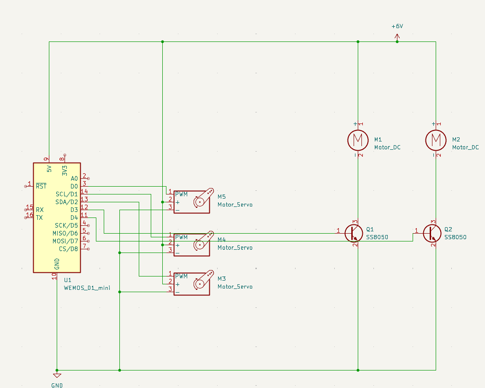
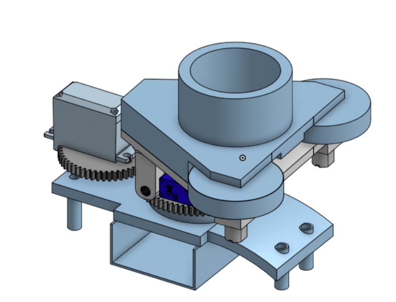

# Tactical-Fortune-Bow

## Description
It has an RC car base that allows it to move around and give people their fortune. It uses flywheels to launch a small disc with a fortune inside whenever it encounters people. It has two beefy servos that allow it to turn left, right, up, and down. There is one tiny motor that powers the launching system to push the fortune discs into the flywheels. Above the discs is a tube that allows for multiple to be stored, carried, and launched all at once.

## Why?

After brainstorming for a solid -2 seconds, we decided to make the Fortune shooter because it was a really fun idea and it is probably the best project to ever exist within the confines of GitHub HQ.

## Video

https://youtu.be/EfSBJAFXDck

## Pictures:

## BOM

1x Lolin Wemos D1 Mini Pro ESP8862 microcontroller
2x N20 900rpm Motor
2x MG 996R Servos
1x SG 90 Microservo
1x Limited edition Spider-Man RC jeep (it's worth a lot, it sells for 12 dollars).
1x Breadboard
1x 9v Alkaline Battery
5x 1.5v Alkaline Battery
1x MagSafe Type-C charging bank
1x Type-C to Type-C charging cable.
As many rubber bands as you can (preferably 10 or more)
Lots of wires, headers, and connectors.
1x SS8050 Transistor
